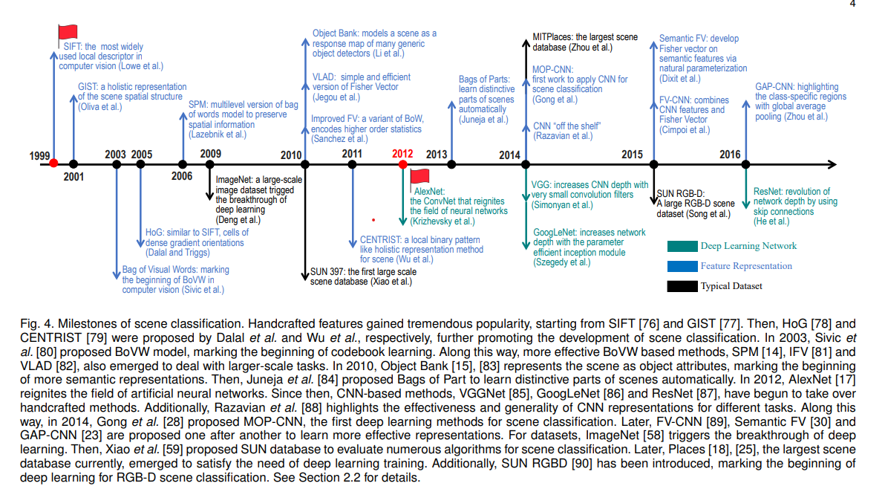

# 칫싵

## 영어논문쓰기
[단어 예문 찾기 ](https://brunch.co.kr/@booungsae/19)

## ubuntu server(?) path
/var/www/html 

## Running background
[Stackoverflow](https://askubuntu.com/questions/8653/how-to-keep-processes-running-after-ending-ssh-session)

## docker cp multiple files in unix
```
for f in data/*txt; do docker cp $f sandbox_web_1:/usr/src/app/data/; done
```

## postgres
[Tutorial](https://www.saltycrane.com/blog/2019/01/how-run-postgresql-docker-mac-local-development/) \
[Create tile from polygon](https://www.azavea.com/blog/2018/10/11/creating-leaflet-tiles-from-open-data/) \
[flask-postgresql-heroku](https://medium.com/@dushan14/create-a-web-application-with-python-flask-postgresql-and-deploy-on-heroku-243d548335cc)

### os command in psql console
```
\! ls
\! sed -i '1d' filename.csv
```

### RUN
```
docker run -it --link kpost:postgres --rm postgres sh -c 'exec psql -h "$POSTGRES_PORT_5432_TCP_ADDR" -p "$POSTGRES_PORT_5432_TCP_PORT" -U postgres'
docker exec -it kpark_postgres_1 psql -h postgres -U kpark postgres
```

### Importing CSV into postgre
```
COPY table_name FROM ‘/path_to_csv_file.csv’ WITH csv;
```

### Create Table : should be same as imported csv columns
```
CREATE TABLE table_name (
id BIGSERIAL NOT NULL PRIMARY KEY,
var1 VARCHAR(50),
var2 VARCHAR(50),
var3 VARCHAR(50),
gender VARCHAR(7)
);
```
### Drop first row
```
DELETE
FROM txn_log
WHERE ctid IN (
        SELECT ctid
        FROM txn_log
        ORDER BY txn_log_timestamp limit 500
        )
```

### Install POSTGIS
```
CREATE EXTENTION postgis
```

### Make a geom column [reference](https://gis.stackexchange.com/questions/122247/st-makepoint-or-st-pointfromtext-to-generate-points)
```
create table test (id serial, x real, y real, geom geometry(POINT, 27700));
insert into test (x, y) select random(), random() from generate_series(1, 1000000);
update test set geom = ST_SetSRID(ST_MakePoint(x, y),27700);
update test set geom = ST_PointFromText('POINT(' || x || ' ' || y || ')', 27700);
```

### Update Column
```
ALTER TABLE table_name
ALTER COLUMN column_name [SET DATA] TYPE new_data_type;
```

### ogr command to docker
```
[ogr example](https://morphocode.com/using-ogr2ogr-convert-data-formats-geojson-postgis-esri-geodatabase-shapefiles/)
ogrinfo PG:"host=* port=5432 user='user' password='password' dbname='dbname'"

ogr2ogr -f "PostgreSQL" PG:"dbname=my_database user=postgres" "source_data.json"

ogr2ogr -f 'PostgreSQL' PG:"host=172.17.0.2 port=5432 user=postgres password=kpass dbname=postgres" 'Downloads/nyct2010.geojson'
```

### host check
```
\conninfo
```
### query & spatial query relating CAPSTONE
```
UPDATE synthe
SET o_zone = subquery.loc
FROM (
SELECT taxi.loc as loc
FROM taxi2 as taxi
JOIN synthe
ON ST_Intersects(taxi.geom, synthe.o_xy)
) AS subquery;
```

### CONCAT
```
ALTER TABLE table_name
ADD column_name column_definition;
UPDATE [table]
SET [column] = CONCAT(state, county, tract)
```
### create new table by statement
```
sql = "SELECT *
FROM nyct2010
RIGHT JOIN acs
ON nyct2010.cd = acs.cd;"
```

### Export psql
```
pg_dump -h 172.17.0.2 -p 5432 -U postgres postgres -N public -T acs > dbexport.pgsql
\copy (SELECT * FROM persons) to 'C:\tmp\persons_client.csv' with csv
```

## git
### git pull force
```
git fetch --all
git reset --hard origin/master
```

## ETC
### Fun!
[Point cloud](https://github.com/heremaps/pptk) # point cloud \
[Transitland animation](https://github.com/transitland/transitland-processing-animation) # transitland animation \
[D3 guide](https://medium.com/@enjalot/the-hitchhikers-guide-to-d3-js-a8552174733a) # d3 \
[Jenks Natural Break](http://qingkaikong.blogspot.com/2018/04/python-jenks-natural-breaks.html) # Jenks Natural Break \
[Street easy analysis](https://observablehq.com/@pstuffa/streeteasy-data-neighborhood-maps) # street easy analysis \
[Postgres, python and JS](https://gis.stackexchange.com/questions/232668/adding-a-postgresql-database-to-a-web-map) # postgres, python and JS (flask or feather) \
[Multi-processing](https://stackoverflow.com/questions/20190668/multiprocessing-a-for-loop) # multi processing python \
[Postgres and JS](https://blog.patricktriest.com/game-of-thrones-map-node-postgres-redis/) # postGIS and nodeJS \
[Making point cloud using Google Street View image](https://gisrecept.blogspot.com/2018/06/new-creating-point-clouds-with-google.html)

### **************** CV? Computer? Graphic? *****************
[3D something](https://github.com/amir32002/3D_Street_View) <br>
[Cool studio](https://studiobehind90.com/) <br>
[Bird's view transformation](https://nikolasent.github.io/opencv/2017/05/07/Bird%27s-Eye-View-Transformation.html) <br>

### Window capture using python
[webkit](http://webscraping.com/blog/Webpage-screenshots-with-webkit/)

### folium
[folium legend](https://nbviewer.jupyter.org/gist/BibMartin/f153aa957ddc5fadc64929abdee9ff2e) \
[plotting map](https://nbviewer.jupyter.org/github/python-visualization/folium/blob/master/examples/GeoJSON_and_choropleth.ipynb?flush_cache=true)

### tmp
[ieee short](https://ieeexplore.ieee.org/stamp/stamp.jsp?arnumber=8419399) # ieee short \
[ieee long](https://www.researchgate.net/profile/Nhat_Hai_Phan/publication/327106790_Deep_Self-Taught_Learning_for_Detecting_Drug_Abuse_Risk_Behavior_in_Tweets_Invited_to_Computational_Social_Network_2018/links/5b795267a6fdcc5f8b53e849/Deep-Self-Taught-Learning-for-Detecting-Drug-Abuse-Risk-Behavior-in-Tweets-Invited-to-Computational-Social-Network-2018.pdf) # ieee long \
[Crime and DNN](https://journals.plos.org/plosone/article/file?id=10.1371/journal.pone.0176244&type=printable) # crime and dnn

### Reinforcement learning
[Reinforcement Learning with Python](https://towardsdatascience.com/reinforcement-learning-with-python-8ef0242a2fa2)

### POSTGIS, JS and Python (postgres, postgis, javascript, python, flask)
[flask1](http://www.jennifergd.com/post/7/)

### Neural-style theory (computer vision)
[Neural-style](https://towardsdatascience.com/neural-style-transfer-tutorial-part-1-f5cd3315fa7f) \
[Rohan & Lenny](https://ayearofai.com/rohan-lenny-2-convolutional-neural-networks-5f4cd480a60b) \
[Neural-style TF tutorial](https://medium.com/tensorflow/neural-style-transfer-creating-art-with-deep-learning-using-tf-keras-and-eager-execution-7d541ac31398) \
[Neural style using Keras](https://medium.com/mlreview/making-ai-art-with-style-transfer-using-keras-8bb5fa44b216)

### Note related to POSTGRESQL
NYC Taxi zone's crs id is EPSG:102718 not supported in POSTGIS right now (refer [here](https://github.com/DataSystemsLab/GeoSpark/issues/185))\
It seems that I can add reference system regarding [this](https://gis.stackexchange.com/questions/260263/srid-for-new-york-city-2010-census-shapefile) but error occurs so that I decided convert it before put it into the db

### Raspbery Pi
[Sensors](https://tutorials-raspberrypi.com/raspberry-pi-sensors-overview-50-important-components/)

### CV & Urban
[SuperParsing]()http://www.cs.unc.edu/~jtighe/Papers/ECCV10/ <br>
[ChangeDetection](http://www.robesafe.com/personal/roberto.arroyo/docs/Alcantarilla16rss.pdf) <br>

### Interpretable Machine Learning
[Korean](http://research.sualab.com/introduction/2019/08/30/interpretable-machine-learning-overview-1.html)

### Mapping
[Carto-js-4](https://carto.com/blog/creative-maps-carto-js-4/)

### BIM & GIS Integration
[Awsome-arcgis](https://github.com/hhkaos/awesome-arcgis/tree/master/esri/business-trends/data-management/bim)

### Image conversion
[블로그인가 pano to fish, fish to sphere 등등](https://www.shuzhiduo.com/A/1O5Ekbrrz7/)<br>
[한국어 fisheye 설명](https://github.com/BlueHorn07/py-fisheye-dewarp/wiki/(KOR)-Fisheye-Dewarp)

### Unity Assets
[site1](https://www.turbosquid.com/Search/3D-Models/free/city/obj)<br>
[site2](https://free3d.com/3d-models/obj-file)

## Isometric image maker
[icogram](https://icograms.com/)

## Dataset for Datathon
https://www.semantic3d.net/view_dbase.php?chl=1#download  

## droplet vnc

```
# 1. Installing XFCE and VNC server
apt update
apt install xfce4 xfce4-goodies tightvncserver
# 1.1. If you're on vultr.com you will need more packages
apt install xfonts-base x11-xserver-utils
# 2. Initial VNC server config
# Prompts to set up password for VNC server here...
vncserver
# Allow clients to connect to X server from any host
# inspired by https://superuser.com/a/392263/140872
DISPLAY=:1 xhost +
# 3. Now creating proper config and restarting the server
vncserver -kill :1
mv ~/.vnc/xstartup ~/.vnc/xstartup.bak
cat << EOF > ~/.vnc/xstartup
#!/bin/bash
xrdb $HOME/.Xresources
startxfce4 &
EOF
chmod +x ~/.vnc/xstartup
# 4. Creating a user account
export USERNAME="username" # Replace with desired user name
useradd --create-home $USERNAME
adduser $USERNAME sudo
passwd $USERNAME
# Copy ssh keys to new user
mkdir -p /home/$USERNAME/.ssh
cp ~/.ssh/authorized_keys /home/$USERNAME/.ssh/
chown -R $USERNAME:$USERNAME /home/$USERNAME/.ssh
# Copy VNC settings to a new user
mkdir -p /home/$USERNAME/.vnc
cp ~/.vnc/xstartup /home/$USERNAME/.vnc/
chown -R $USERNAME:$USERNAME /home/$USERNAME/.vnc/
# 5. Start VNC server
# Stop command. Just in case. Ignore errors here
su $USERNAME -c "vncserver -kill :1"
# Start
su $USERNAME -c "vncserver -depth 24 -geometry 1280x800"
# 6. How to stop VNC server when you are done?
# su $USERNAME -c "vncserver -kill :1"
```

## Scene Classification Milestone
https://medium.com/@achekulaev/how-to-set-up-linux-desktop-environment-in-the-cloud-with-digitalocean-droplet-e51ae4e066b  
  
source: Zeng, D., Liao, M., Tavakolian, M., Guo, Y., Zhou, B., Hu, D., ... & Liu, L. (2021). Deep Learning for Scene Classification: A Survey. arXiv preprint arXiv:2101.10531.

